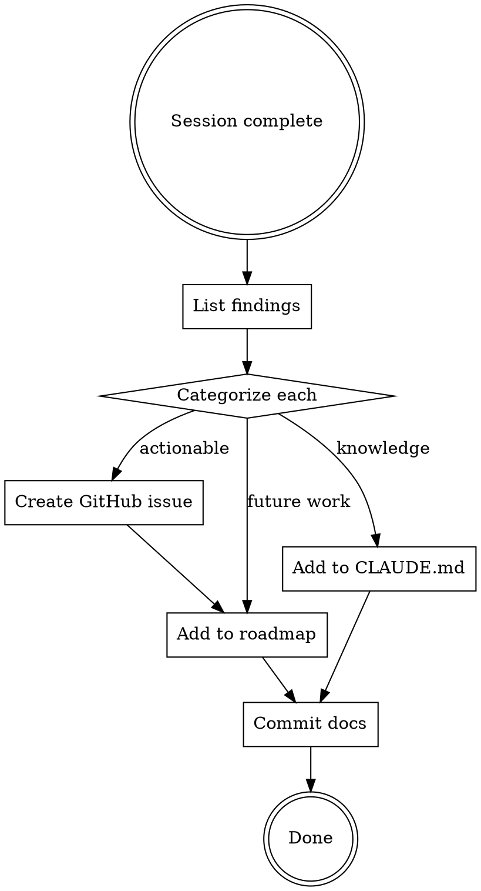

# Documenting Session Findings

## Overview

Capture session discoveries as durable project knowledge before they're lost to context. Findings become GitHub issues, CLAUDE.md gotchas, and roadmap entries.

## When to Use

- After a smoke test reveals bugs or UX issues
- After discovering a gotcha that cost debugging time
- After merging a feature branch, before starting new work
- When you think "we need to track this" about anything found during the session

## The Process

### 1. List Findings

Review the session for:
- Errors encountered and their root causes
- Workarounds applied (these mask real bugs)
- Things that weren't obvious until you hit them
- Minor issues deferred during implementation

### 2. Categorize and Act

| Finding type | Action | Where |
|---|---|---|
| Bug (broken behavior) | GitHub issue with repro steps | `gh issue create` with `bug` label |
| Enhancement (missing feature) | GitHub issue with expected behavior | `gh issue create` with `enhancement` label |
| Gotcha (non-obvious knowledge) | One-line addition | Project `CLAUDE.md` under relevant section |
| Future work (tracked item) | Roadmap entry with issue cross-ref | Project roadmap doc |

### 3. GitHub Issue Quality

Each issue should include:
- **Title**: What's wrong/missing (not how to fix)
- **Root cause**: Why it happens (if known)
- **Repro steps or observed behavior**: What you saw
- **Expected behavior**: What should happen
- **Affected files**: Where to look

### 4. CLAUDE.md Updates

**REQUIRED SUB-SKILL:** Use claude-md-management:revise-claude-md for the CLAUDE.md update step. It has a structured review process that produces higher-quality entries than ad-hoc additions.

### 5. Commit

Single commit with all doc changes: `docs: capture session findings (#N, #M, ...)`

## Common Mistakes

| Mistake | Fix |
|---|---|
| Creating issues without root cause | Include what you learned, even if partial |
| Verbose CLAUDE.md entries | One line per gotcha. Link to issues for details. |
| Forgetting to cross-reference | Always link roadmap entries to issue numbers |
| Skipping this entirely | Session findings evaporate. 5 minutes now saves hours later. |
