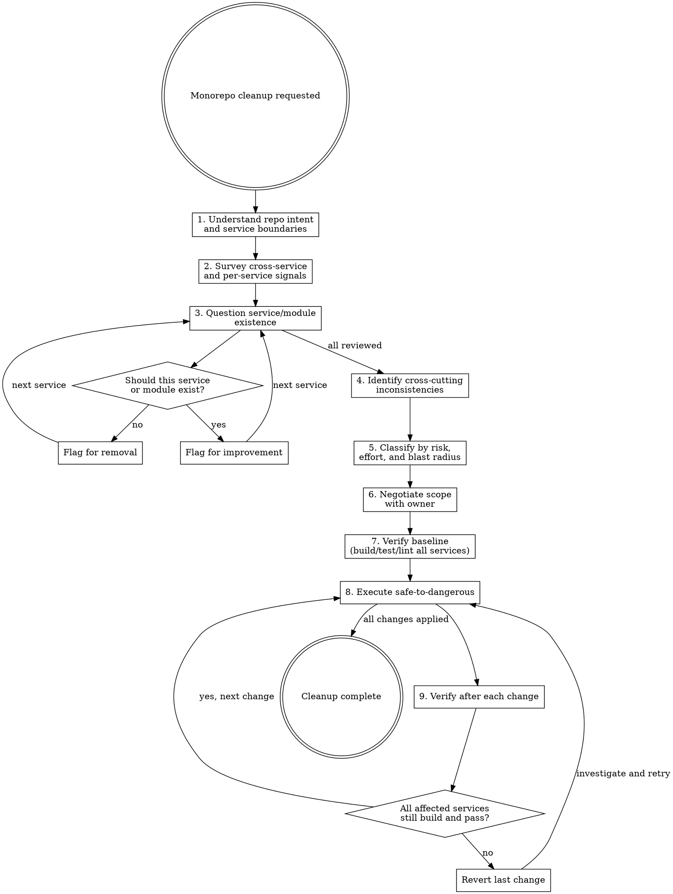

# Monorepo Cleanup

## Overview

Systematic monorepo cleanup that asks "does this service/module still belong?" before "how can I improve it?" The core failure modes in monorepo cleanup are: refactoring code that should be deleted, harmonizing patterns that should stay different, and treating each service in isolation when the real problems are cross-cutting.

**Core principle:** Removal over refactoring. Consistency over cleverness. Cross-service awareness over local optimization. Verify before and after every change.

## When to Use

- Monorepo with services that have drifted from shared conventions
- Cross-service dead code, orphaned infrastructure, or abandoned experiments
- Shared libraries or config that no longer match reality
- Docker Compose / CI / deployment configs that have accumulated cruft
- Dependency version drift across services
- Pre-refactor audit of a multi-service codebase
- Suspicion that services or modules are unused, duplicated, or could be consolidated

**When NOT to use:**
- Single-service cleanup (use `cleaning-up-codebases` instead)
- Greenfield monorepo (nothing to clean)
- Single targeted bug fix within one service
- Performance optimization (different methodology)

## Process

### Step 1: Understand Repo Intent and Service Boundaries

**Before touching code, understand the monorepo's architecture and each service's role.**

Read in this order:
1. Root README.md / CLAUDE.md - stated purpose, service map, architecture overview
2. Docker Compose files - actual service topology, dependencies, networking
3. CI/CD configuration - what's built, tested, deployed, and in what order
4. Each service's README.md / CLAUDE.md - individual service purpose
5. Git log (recent commits across services) - what's actively being worked on
6. Shared infrastructure / libraries - what's meant to be common

**What you're looking for:**
- Services that exist in code but aren't mentioned in docs or Docker Compose
- Services in Docker Compose that no longer have corresponding code
- Mismatches between documented architecture and actual service topology
- Services that overlap in responsibility
- Shared code that only one service uses (or no services use)

### Step 2: Survey with Automated Scans

Run systematic searches **across the entire monorepo**, not service by service. **Count what you find** — concrete numbers are more actionable than vague impressions.

**Dead service signals:**
- Service directories with no recent commits (months/years stale)
- Services not referenced in Docker Compose or CI
- Services with no health endpoint or API consumers
- Services whose database has no recent writes

**Cross-service dead code signals:**
- Shared libraries/packages imported by zero or one service
- Protobuf/API definitions with no consumers
- Database migrations that reference removed tables/columns
- Environment variables defined in `.env` but referenced by no service
- Docker volumes, networks, or configs that nothing uses

**Per-service dead code signals (same as single-codebase cleanup):**
- Unused imports/modules, uncalled functions, files nothing imports
- Feature flags, "coming soon" placeholders, commented-out code
- Alternate implementations (`v2` alongside `v1`)

**Consistency signals (cross-service):**
- Different error handling patterns across services
- Inconsistent logging (structured vs unstructured, different field names)
- Mixed dependency versions for the same library
- Different config loading approaches
- Inconsistent directory structures
- Services not following the established bootstrap/startup pattern

**Infrastructure cruft signals:**
- Docker Compose services that are commented out or have `profiles` nobody uses
- CI steps that are skipped, `allow_failure`, or reference removed services
- Nginx/proxy routes to services that no longer exist
- Orphaned Dockerfiles, config files, or scripts
- Stale `.env.example` entries
- Monitoring/alerting configs for removed services

**Dependency drift signals:**
- Same library at different versions across services (`go.mod` / `package.json` comparison)
- Vendored dependencies that are stale
- Dependencies pulled in for a single non-core feature

### Step 2b: Establish a Clean Baseline (Build, Test, Lint — All Services)

**Before you can evaluate the code, make sure every service's toolchain is healthy.**

Run every standard check for every service and record the results:
1. **Build all services** — Record which pass/fail
2. **Test all services** — Record pass/fail/skip counts per service
3. **Lint all services** — Record warning/error counts per service
4. **Docker Compose** — `docker compose config` to validate compose files
5. **Also capture:** total line counts per service, dependency counts, number of services

These numbers are your baseline. After cleanup, the delta tells the story.

**What you're looking for:**
- Services that don't build or have failing tests (foundation problems)
- Services with significantly more lint warnings than others (quality drift)
- Services that are disproportionately large or small for their stated purpose

### Step 2c: Evaluate at Macro and Micro Levels

**Macro (repo-level):**
- Does the directory structure match the documented architecture?
- Are service boundaries clear, or do services reach into each other's internals?
- Is shared infrastructure (Docker Compose, CI, scripts) well-organized or scattered?
- Are there top-level directories that don't correspond to any service or purpose?
- Do all services follow the same structural conventions?

**Service-level:**
- Does each service have a clear, single responsibility?
- Are there services that are just thin wrappers around one dependency?
- Are there services that should be merged (too granular) or split (too broad)?
- Do service databases have tables that belong to other services?

**Micro (file/function-level) — spot-check across services:**
- Are tests testing behavior or just chasing coverage?
- Are there god files doing unrelated things?
- Is there copy-paste code across services that should be shared (or vice versa)?

**Infrastructure evaluation:**
- Do Docker Compose configs match documented service topology?
- Are environment variables consistent across services that need the same config?
- Are healthcheck definitions present and accurate?
- Do `depends_on` declarations reflect actual dependencies?

### Step 3: Question Service and Module Existence

For EVERY service and major module, ask:

1. **Does this align with the monorepo's stated purpose?** If not, it's a removal or extraction candidate.
2. **Is this actively used and deployed?** Check Docker Compose, CI, and recent git history.
3. **Could this be merged with another service?** If two services share a database or always deploy together, consider merging.
4. **Could this be extracted to its own repo?** If it has zero dependencies on other services.
5. **Was this fully implemented?** Half-finished services are worse than no service.

**NEVER default to "refactor this to be better." The first question is always "should this exist at all?"**

### Step 4: Identify Cross-Cutting Inconsistencies

This step is unique to monorepo cleanup. Look for patterns that should be consistent but have drifted:

| Area | What to check | Why it matters |
|------|---------------|----------------|
| **Logging** | Same structured format? Same field names? | Cross-service log queries break when formats differ |
| **Error handling** | Same patterns? Same error types? | Inconsistency makes debugging harder |
| **Config loading** | Same approach? Same env var naming? | Reduces cognitive load when switching services |
| **Bootstrap/startup** | Same pattern? Same lifecycle hooks? | New services should follow established patterns |
| **Testing** | Same frameworks? Same conventions? | Makes it easier to contribute across services |
| **Directory structure** | Same layout? | Predictability across services |
| **API conventions** | Same URL patterns? Same response formats? | Client consistency |
| **Docker** | Same base images? Same build patterns? | Build consistency, security patching |

**Don't harmonize for the sake of harmonizing.** Only flag inconsistencies that cause real problems (debugging difficulty, onboarding confusion, maintenance burden). Some services legitimately need different approaches.

### Step 5: Classify Findings

Separate findings into tiers. **Blast radius matters more in a monorepo** — a change that breaks one service is T2, a change that breaks three is T3.

| Tier | Description | Examples | Typical effort |
|------|-------------|----------|----------------|
| **T1: Safe deletes** | Dead code, unused services, orphaned config | Remove abandoned service directory, delete unused Docker Compose entries, clean stale env vars | 5-30 min |
| **T2: Single-service fixes** | Isolated improvements within one service boundary | Fix lint warnings in one service, update stale dependencies, add missing error handling | 1-3 hours |
| **T3: Cross-service fixes** | Changes touching 2+ services that must be coordinated | Harmonize logging format, update shared library version, consolidate duplicated code into shared package | 1-3 days |
| **T4: Architectural changes** | Structural changes to service boundaries or shared infrastructure | Merge/split services, redesign shared infrastructure, change CI pipeline structure | Scheduled project |

**Timebox each tier.** If a T1 delete is taking hours, it's probably a T2. If a T3 fix is stretching past days, stop and re-scope with the owner.

### Step 6: Negotiate Scope with Owner

**Present findings to the user before creating any plan.** For monorepos, organize findings by:

1. **Repo-wide issues** (dead services, infrastructure cruft, dependency drift)
2. **Cross-service issues** (inconsistencies, shared code problems)
3. **Per-service issues** (grouped by service)

Ask:
- "I found N services/modules that seem unused or abandoned. Which do you want to keep?"
- "These M services have drifted from the established patterns. Which inconsistencies matter to you?"
- "Here are the safe deletes I can make right now. Should I proceed?"
- "These cross-service changes need coordination. Which are worth the effort?"

**Never assume what the owner values.** An "abandoned" service might be planned for revival.

### High-Risk Areas (Do Not Modify Without Owner Approval)

Some things look like cleanup targets but are dangerous in a monorepo:

- **Database migration scripts** (even old ones — rollback paths depend on them)
- **Shared libraries used by multiple services** (changes cascade)
- **Docker Compose networking and volume definitions** (services depend on these names)
- **CI/CD pipeline configuration** (affects all services)
- **API contracts between services** (breaking changes cascade)
- **Environment variable names** (may be referenced in deployment configs you can't see)
- **Infrastructure as Code** (Terraform, Ansible, etc.)
- **Nginx/proxy routing rules** (external clients depend on these)
- **Feature flags tied to business logic**
- **Anything with `DO NOT DELETE` / `KEEP` comments**

If it's ugly but load-bearing, leave it alone until you've confirmed with the owner.

### Step 7: Verify Baseline

Re-run the checks from Step 2b immediately before you start making changes. Confirm build, tests, and lint all still match your earlier snapshot for every service you'll touch.

**If anything regressed since Step 2b, fix that first.** Don't add cleanup on top of a broken build.

### Step 8: Execute Safe-to-Dangerous

**Order of operations:**
1. **T1 first:** Delete dead services, unused files, orphaned config
2. **T2 next:** Single-service fixes (one service at a time)
3. **T3 then:** Cross-service fixes (coordinate carefully)
4. **T4 last:** Architectural changes (separate branch, separate review)

**After each change:** Build and test **all affected services**, not just the one you touched. A change to a shared library requires testing all consumers.

### Step 9: Verify After Each Change

Not "at the end." After EACH significant change:
- All affected services build
- All affected services pass tests
- No new lint warnings introduced
- Docker Compose still validates (`docker compose config`)
- Cross-service integrations still work (if testable)
- Docs still reflect reality
- Commit the working state

## Definition of Done

Cleanup is complete when:
- All agreed-upon T1/T2 items are resolved
- Lint, test, and build results for all services are **equal to or better than** baseline
- No unused services, dependencies, or infrastructure config remains
- Removed services/features are no longer referenced in docs, Docker Compose, CI, or config
- Cross-service inconsistencies flagged in T3 are either resolved or explicitly accepted
- Owner has signed off on the final state

This is "improvement over baseline," not "perfection."

## Common Mistakes

| Mistake | What to do instead |
|---------|-------------------|
| Cleaning one service in isolation without checking cross-service impact | Always check who consumes/depends on what you're changing |
| Harmonizing patterns that legitimately differ | Only harmonize when inconsistency causes real problems |
| Refactoring code that should be deleted | Ask "should this exist?" first |
| Adding new abstractions during cleanup | Cleanup means LESS code, not different code |
| Updating a shared library without testing all consumers | Build and test every service that imports the shared code |
| Deleting a service without checking Docker Compose, CI, and nginx | Trace all references before removal |
| Treating all services as equal priority | Focus on actively developed services first |
| Planning a multi-week cleanup | Start with T1 deletes. Reassess after. |
| Not involving the owner in scope decisions | Present findings, don't prescribe solutions |
| Going service-by-service instead of scanning patterns across the repo | Use grep/glob across the whole monorepo first |

## Red Flags - You're Doing Cleanup Wrong

- You're writing MORE code than you're deleting
- You're creating new services or shared libraries during a cleanup
- You're harmonizing logging formats before removing dead services
- Your cleanup plan has 5+ phases spanning weeks
- You changed a shared library without testing all consumers
- You haven't asked the owner what they want to keep
- You haven't verified all services build and pass tests
- You're optimizing service performance during a dead code removal
