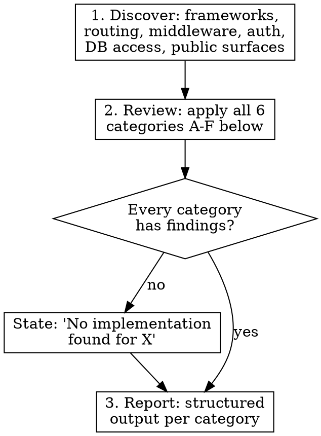

# Security Review

## Overview

Deterministic, enterprise-grade security review of any service directory. Inspects actual code — not summaries — and produces a structured, reviewer-friendly report organized by security domain.

**Core principle:** Every finding references a real file and line number. Every gap is stated explicitly. No generic advice.

## Invocation

```
/security-review <path>
```

## Execution

Dispatch using the `security-reviewer` subagent type via the Task tool. This subagent has read-only access (Read, Glob, Grep) and cannot modify files.

```
Task(subagent_type="security-reviewer", prompt="[skill content + path]")
```

If the service interacts with another service (e.g., HMAC signing between Laravel and Go), dispatch a second subagent for the other side of the boundary and cross-reference findings.

## Process



### Step 1: Discover

Load and inspect all code under `<path>`. Identify:

- **Framework & router** (Echo, Gin, Laravel, Express, etc.)
- **Auth mechanisms** (middleware, guards, HMAC, sessions, tokens, API keys)
- **Route registration** (every route, grouped by auth requirement)
- **Database access layer** (ORM, raw queries, repositories)
- **Public/unauthenticated surfaces**
- **Configuration loading** (env, config files, secrets)

### Step 2: Review All 6 Categories

You MUST review every category below. If a category has no findings, explicitly state: **"No issues found. [Brief description of what was verified.]"**

Do NOT skip categories. Do NOT merge categories.

### Step 3: Produce Report

Output follows the strict format defined in the Output Format section below.

## Required Review Categories

### A. Authentication & Identity Boundary

- Identify all auth mechanisms (HMAC, sessions, tokens, middleware, guards)
- For EVERY protected route, verify auth middleware is applied — enumerate them
- Check timestamp windows, replay protection, nonce/idempotency
- Check HMAC/signature scope: is the signature bound to method, path, and body, or just user+timestamp?
- Check error behavior on auth failure: does it log? Does it leak info?
- Check for bypass paths: routes that should be protected but aren't
- Check secret strength: minimum length enforcement, rotation support

### B. Multi-tenancy & Access Control

- For EVERY route that accepts an ID parameter, confirm scoping to the authenticated user/tenant
- Show the exact query or repository call that enforces ownership
- Flag any handler that trusts a client-provided ID without server-side ownership check
- Check for "list all" endpoints that could leak cross-tenant data
- Check for IDOR (Insecure Direct Object Reference) patterns

### C. Input Validation & Schema Handling

- Identify all request DTOs, form requests, validators, and schema parsing
- Check required fields, type coercion, max sizes on individual fields
- Check for unknown/extra field rejection (does the API silently accept unexpected fields?)
- Check JSON/form schema handling for injection or unsafe interpretation
- Check submission/request body size limits (both global and per-endpoint)
- Check file upload validation if applicable (type, size, name sanitization)

### D. Public Surface & Abuse Resistance

- List every unauthenticated route explicitly
- Check rate limiting: enabled by default? Per-endpoint limits? Global vs. granular?
- Check CORS configuration: origins, credentials, headers, methods
- Check CSRF posture for embedded or cross-origin form submission
- Check that public schema/validation/embed endpoints do not leak sensitive field metadata
- Check for information disclosure in public error responses

### E. Secrets, Logging, and Storage

- Identify all config loading (env files, config files, viper, dotenv)
- Check for hard-coded secrets in source or committed config files
- Check default secret values (do they fail safely or create weak defaults?)
- Check DB connection security: TLS, connection string exposure, least privilege
- Audit logging: does it log PII, full request payloads, or secrets?
- Check for sensitive data in error messages or stack traces sent to logs

### F. Operational Hardening

- Check health/debug/status endpoints for information leakage (versions, config, internal state)
- Check for exposed pprof, debug, metrics, or test routes in production builds
- Check build flags: is there a production mode? Are debug features gated?
- Check error responses: do they expose stack traces, internal paths, or implementation details?
- Check security headers: HSTS, CSP, X-Frame-Options, X-Content-Type-Options
- Check for conflicting security headers (e.g., X-Frame-Options DENY on routes that need framing)

## Output Format

**You MUST follow this structure. No deviations.**

**Start with a Discovery Summary** listing: framework, auth mechanisms, route groups (authenticated vs public), database access layer, config loading method, and public surface inventory.

Then for each category A through F, produce three sections:

### [Category Letter]. [Category Name]

#### Findings

Bullet list of concrete findings. Each finding MUST include:
- **Severity tag**: `[CRITICAL]`, `[WARNING]`, or `[INFO]`
- **File path and line number**: `file.go:42`
- **What was found**: factual description referencing actual code
- **If nothing found**: "No issues found. Verified: [what was checked]."

#### Risks

Practical, real-world impact of each finding. No hypotheticals without basis in the code.

#### Recommendations

Specific, implementable changes:
- Which file to modify
- What to add/change (middleware, validation, config)
- Code snippet if the fix is non-obvious

**Summary table at the end:**

```
| Severity | Count | Key Themes |
|----------|-------|------------|
| CRITICAL | N     | ...        |
| WARNING  | N     | ...        |
| INFO     | N     | ...        |
```

## Constraints

These are non-negotiable:

- **No generic advice.** "Consider improving security" is not a finding.
- **No "should consider" language.** Recommendations must be concrete and actionable.
- **Every finding references actual code.** File + line number required.
- **No hallucinated files or functions.** If you haven't read it, don't cite it.
- **If a control is missing, say so explicitly.** "No implementation found for X" is a valid and required finding.
- **Report by category (A-F), not by severity.** Severity tags go on individual findings.
- **Positive findings are allowed** as `[INFO]` items — note what's implemented well.
- **Cross-service boundaries:** If the service interacts with another (e.g., HMAC signing between Laravel and Go), trace both sides of the boundary.

## Common Mistakes

| Mistake | Fix |
|---------|-----|
| Organizing report by severity instead of category | Use A-F categories as top-level sections |
| Skipping categories that "look fine" | Every category must appear. State "No issues found" with what was verified |
| Generic input validation finding without checking specific DTOs | Read every request handler's DTO/form request. Check each field |
| Missing the logging audit | Grep for log calls. Check what gets logged on errors and on success |
| Citing files without reading them | Read the file first. Never cite a line number you haven't verified |
| Checking rate limits exist but not checking if they're enforced | Verify the middleware is actually wired to routes, not just defined |
